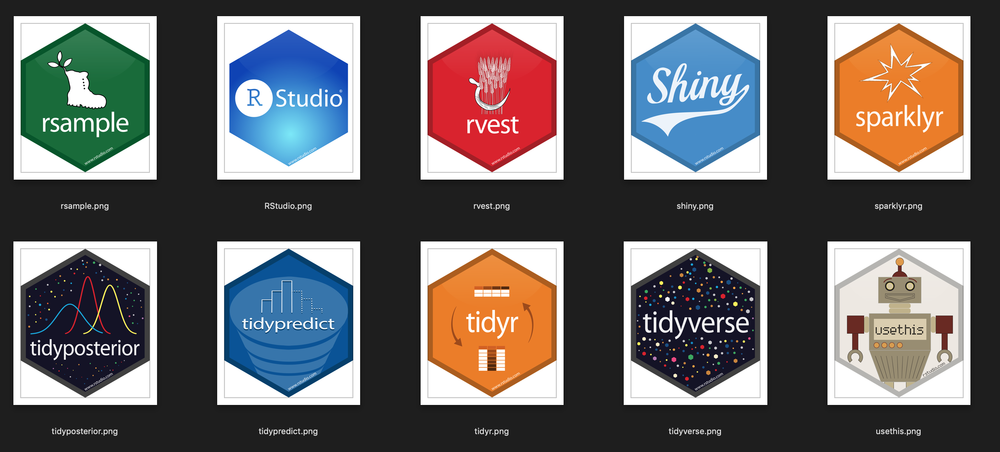

# BerlinR - an R group focussed on modern data science

##### Meetup 2 : Optimization in R 

Prasanna Bhogale
05-02-2019

---

## Introduction to the meetup

---

Data scientists are not (only) statisticians
--

- **Culture and organization** : links with software engineering (version control, agile, high quality code)
- **Tool mediated advances** : algorithms closely linked to developments in hardware (GPUs) make whole new classes of problems tractable
- **Data science in the wild** : the cloud, the docker revolution and devops (you build it, you run it)
- **Visualization** : Javascript libraries and ever increasing expectations about quality and interactivity of visualizations
- **Powerful conceptual frameworks** : Auto diff, gradient descent (TF, PyTorch), causal graphs (Judea Pearl), Bayesian everything

---

Objectives of BerlinR
---

- Exploring **modern data science** from the R ecosystem (and explore surroundings.. JS ? Stan ? Keras ? API building ?)
- **Learning new concepts** and skills that unlock important, interesting or beautiful aspects of data science in R
- Covering **full stack data science** in R - from statistics to deep learning in production and everything in between
- Exploring interesting use cases and **domain specific challenges**

---

Principles of BerlinR
---

- **Welcoming** : there are no stupid questions, there is always help available
- **Uncool** : make hard things easy, don't create inaccessible cliques around certain skillsets
- **Curious** : learn everything, become better at everything, explore application domains
- **Useful** : every talk should have 
	- clear conceptual takeaways 
	- reusable code
- **Collaborative** : Pitch in to give talks, do side projects, contribute to the R community

---

Meetup-1 roundup
---

- Bayesian statistics and Probabilistic programming with [Greta](https://greta-dev.github.io/greta/) 
- Link to last meetup : https://www.meetup.com/BerlinR-R-users-group/events/255782054/
- Code and presentations https://github.com/pbhogale/berlinr-meetup1-bayesian

---

Suggestions for topics 1
---

- Talk 1 : Industry perspective on data science for claims analysis (or something along these lines)
- Talk 2 : Claims data exploration and predictive models with Kaggle data (https://www.kaggle.com/competitions?sortBy=relevance&group=general&search=claims&page=1&pageSize=20)

---

Suggestions for topics 2
---

- Talk 1 : Introduction to data collection in R. http://www.r-datacollection.com/
- Talk 2 : Introduction to causal analysis (directed acyclic graphs ? sensitiviti analysis, ? simpson's paradox ?)

---

Suggestions for topics 3
---

- Talk 1 : Bayesian analysis 2 - how p values need never be used again
- Talk 2 : Bayesian models in production - deploying to the cloud

---

Please volunteer your suggestions and comments :)

---

Prasanna Bhogale
pbhogale@gmail.com