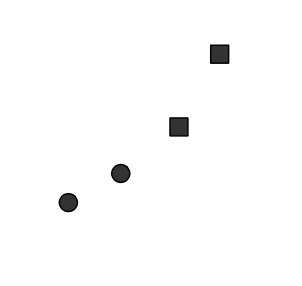

Grammar of (statistical) graphics : a tiny overview
========================================================
author: Prasanna Bhogale
date: 05-02-2019
autosize: true

with infinite gratitude to Hadley [Wickham](http://vita.had.co.nz/papers/layered-grammar.html)

Grammar
========================================================

“the fundamental principles or rules of an art or science”

Grammar + Vocabulary $\rightarrow$ Communication


Statistical graphics as a list
========================================================

[Types of chart in MS Excel](https://support.office.com/en-us/article/Chart-types-51043d4c-15bd-46f1-bc87-e81195e5b5e0#bmxl)

Clustered column chart, Stacked column chart, 100% stacked column chart, 3-D column chart, Cylinder, cone, and pyramid chart, 
Line chart, Stacked line chart, 100% stacked line chart, 3-D line chart, Pie chart, Pie of pie or bar of pie chart, 
Exploded pie chart, Clustered bar chart, Stacked bar chart, 100% stacked bar chart and 100% stacked bar chart in 3-D, 
Horizontal cylinder, cone, and pyramid chart, Area chart, Stacked area chart, 100% stacked area chart, Scatter chart, 
Scatter chart with smooth lines and scatter chart with smooth lines and markers, Scatter chart with straight lines and scatter chart with straight lines and markers, Bubble chart, Bubble chart or bubble chart with 3-D effect, High-low-close stock chart, 
Open-high-low-close stock chart, Volume-high-low-close stock chart, Volume-open-high-low-close stock chart, Doughnut chart, Exploded doughnut chart, Radar chart, Filled radar chart . . . . .


Elements of the grammar
========================================================

- Data 


from [Wickham 2010](http://vita.had.co.nz/papers/layered-grammar.html)

Elements of the grammar
========================================================

- Data 
- Mapping data to aesthetics
    - Geometry : points, lines, bars, colours, shapes...
    - Coordinates system : position on plane 

 $\rightarrow$ 

from [Wickham 2010](http://vita.had.co.nz/papers/layered-grammar.html)


Elements of the grammar
========================================================

- Data 
- Mapping  data to aesthetics
- Mapping aesthetics to display

 $\rightarrow$  $\rightarrow$ 


from [Wickham 2010](http://vita.had.co.nz/papers/layered-grammar.html)

Elements of the grammar
========================================================

- Data $\rightarrow$ aesthetics $\rightarrow$ display
- Scales : displaying relationship of position to data
    
 $\rightarrow$  $\rightarrow$ 


from [Wickham 2010](http://vita.had.co.nz/papers/layered-grammar.html)

A language instead of a list
========================================================


```r
bars + 
    geom_bar()
```


A language instead of a list
========================================================

```r
bars + 
    geom_bar(width=1) + 
    coord_polar(theta='y')
```


A language instead of a list
========================================================

```r
bars + 
    geom_bar(width=1) + 
    coord_polar(theta='x')
```


Building a complex graphic
========================================================


A retreat from Russia
========================================================


```r
troops <- read_csv("minard-troops.csv")
head(troops)
```

```
# A tibble: 6 x 5
   long   lat survivors direction group
  <dbl> <dbl>     <int> <chr>     <int>
1  24    54.9    340000 A             1
2  24.5  55      340000 A             1
3  25.5  54.5    340000 A             1
4  26    54.7    320000 A             1
5  27    54.8    300000 A             1
6  28    54.9    280000 A             1
```


Napoleon in Russia : path
========================================================


```r
ggplot(troops) + 
    geom_path(aes(x=long,y=lat), size=2) + 
    theme_tufte()
```


Napoleon in Russia : attack and retreat
========================================================


```r
ggplot(troops) + 
    geom_path(aes(x=long,y=lat, colour=direction, group=group), size=2) + 
    theme_tufte()
```


Napoleon in Russia : a defeated army
========================================================


```r
ggplot(troops) + 
    geom_path(aes(x=long,y=lat, colour=direction, group=group, size=(survivors))) + 
    theme_tufte()
```


Grammar + Vocabulary = Power
========================================================

Most modern data visualization systems use the grammar of graphics. 

- [Scribbletone](https://www.scribbletone.com/typefaces/ff-chartwell)
- [D3.js](https://d3js.org/)
- [Plotly](https://plot.ly)
- [Tableau](http://www.tableau.com/trial/tableau-10)
- [Flowingdata](https://flowingdata.com/2016/06/28/distributions-of-annual-income/)
- [ggplot](http://www.springer.com/gp/book/9780387981413)


Converting legacy statistical visualizations to modern, java script and grammar based graphics is a lucrative industry.


ToDo
========================================================

- Think in the grammar
- Learn the vocabulary (JavaScript, d3.js)
- Write visual poetry !


