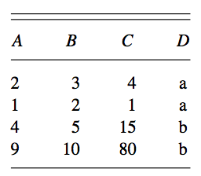
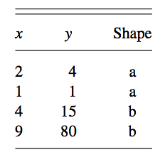
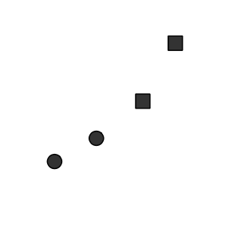
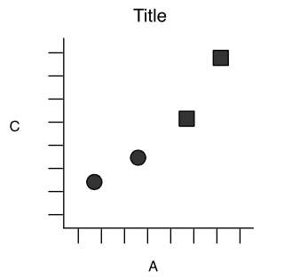

<!-- $size: 16:9 -->
# Grammar of (statistical) graphics : a tiny overview

**Prasanna Bhogale
BerlinR - Meetup2**
05-02-2019

with infinite gratitude to [Hadley Wickham](http://vita.had.co.nz/papers/layered-grammar.html)

---

Grammar
---

“the fundamental principles or rules of an art or science”

**Grammar + Vocabulary $\rightarrow$ Communication**

---

Statistical graphics as a list
---

[Types of chart in MS Excel](https://support.office.com/en-us/article/Chart-types-51043d4c-15bd-46f1-bc87-e81195e5b5e0#bmxl)

<small>Clustered column chart, Stacked column chart, 100% stacked column chart, 3-D column chart, Cylinder, cone, and pyramid chart, Line chart, Stacked line chart, 100% stacked line chart, 3-D line chart, Pie chart, Pie of pie or bar of pie chart, Exploded pie chart, Clustered bar chart, Stacked bar chart, 100% stacked bar chart and 100% stacked bar chart in 3-D, Horizontal cylinder, cone, and pyramid chart, Area chart, Stacked area chart, 100% stacked area chart, Scatter chart, Scatter chart with smooth lines and scatter chart with smooth lines and markers, Scatter chart with straight lines and scatter chart with straight lines and markers, Bubble chart, Bubble chart or bubble chart with 3-D effect, High-low-close stock chart, Open-high-low-close stock chart, Volume-high-low-close stock chart, Volume-open-high-low-close stock chart, Doughnut chart, Exploded doughnut chart, Radar chart, Filled radar chart . . . . .</small>

---

Elements of the grammar
---

- Data 




from [Wickham 2010](http://vita.had.co.nz/papers/layered-grammar.html)

---

Elements of the grammar
---

- Data 
- Mapping data to aesthetics
    - Geometry : points, lines, bars, colours, shapes...
    - Coordinates system : position on plane 

 $\rightarrow$ 

from [Wickham 2010](http://vita.had.co.nz/papers/layered-grammar.html)

---

Elements of the grammar
---

- Data 
- Mapping  data to aesthetics
- Mapping aesthetics to display

 $\rightarrow$  $\rightarrow$ 

from [Wickham 2010](http://vita.had.co.nz/papers/layered-grammar.html)

---

Elements of the grammar
---

- Data $\rightarrow$ aesthetics $\rightarrow$ display
- Scales : displaying relationship of position to data
    
 $\rightarrow$  $\rightarrow$ 

from [Wickham 2010](http://vita.had.co.nz/papers/layered-grammar.html)

---

A language instead of a list
---

```{r, eval=TRUE, echo=FALSE}
bars <-  qplot(clarity, data=diamonds, geom="blank", fill=clarity) +
   scale_fill_brewer(palette="YlGnBu")
stack <- bars + aes(x = factor(1)) + scale_x_discrete(labels = "")
```

```{r}
bars + geom_bar()
```
---

